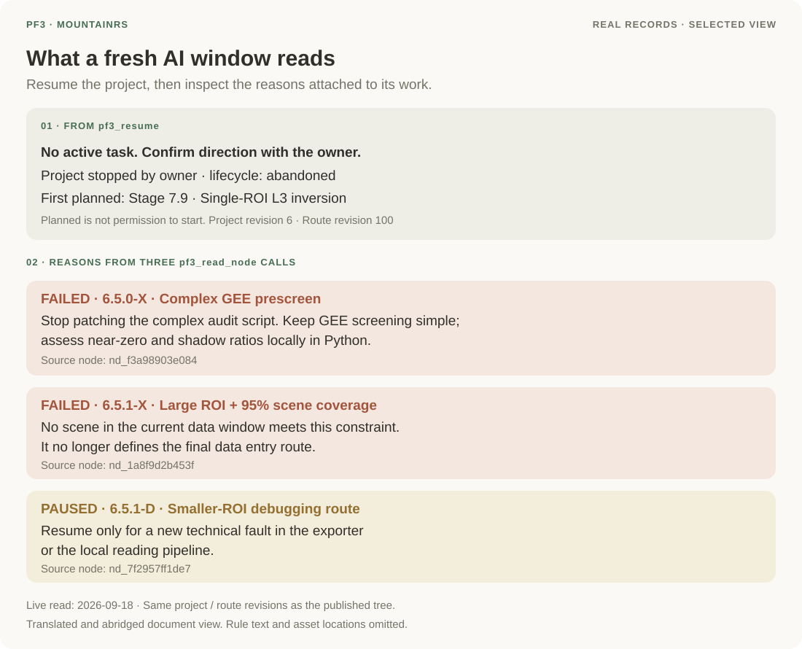
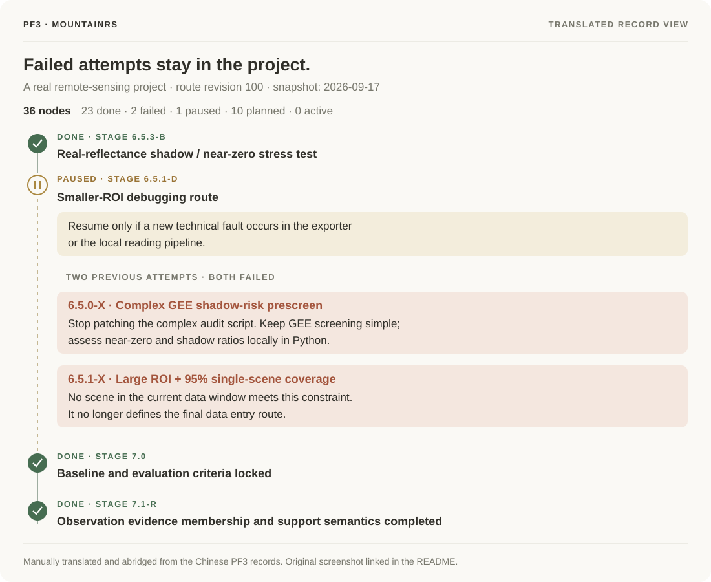

# PF3 Showcase · Project Forest 3

**Keep long-running AI projects ready to resume.**

[中文](README.zh-CN.md) · [Handoff context](#what-a-fresh-window-receives) · [Real case](#a-real-project-mountainrs) · [Protocol demo](#protocol-demo) · [Design notes](docs/design.md)

PF3 assembles context for a fresh AI session from shared project state: tasks, decisions, failed attempts, and applicable constraints.

This repository contains **design notes, a real MountainRS workflow snapshot, and an independent handoff example you can run locally**, with a protocol draft, JSON Schema and contract tests.

## The problem at handoff

The code and reports may still be there when the AI window changes. Before continuing, the new window also needs to establish:

- Which task is current, and which paths have already been tried?
- Why did an earlier attempt stop, and what would justify returning to it?
- Which constraints apply, and is the state it read still current when it writes back?

When these decisions are scattered through chat, the next window has to reconstruct them. PF3 records them with the relevant work: routes organize tasks, executed attempts retain their conclusions, rules have an explicit scope, and a handoff carries the current context and write-back version. The [design notes](docs/design.md) explain these choices and their tradeoffs.

## What a fresh window receives

People and agents record decisions and evidence as they work. PF3 assembles a handoff from the stored project state when a new window reads it.

| During the work | At the next handoff |
|---|---|
| Tasks and progress belong to project nodes. | The current task, its intent and selected recent progress appear together. |
| Failed attempts retain conclusions; paused work retains its reason. | Referenced conclusions appear in context; other node details remain available to read. |
| Rules belong to a global or project scope; constraints target nodes. | The handoff includes active global rules, project rules and pending constraints for the current node. |
| Writes update shared, versioned state and leave receipts. | A client receives write revisions; stale writes are refused and require rereading. |

This reduces the work of assembling a new handoff each time a window changes. Recording useful evidence and checking the referenced files remain part of the work. See the [design notes](docs/design.md#what-is-assembled-and-what-still-needs-a-reader).

In **MountainRS**, the current handoff starts with a concrete fact: **there is no active task**. A fresh window must establish the owner's direction before starting. It can then read why the earlier approaches failed and when paused work may resume.



*Translated reading view of real PF3 calls, September 18, 2026. Section 1 comes from `pf3_resume`; section 2 comes from three subsequent `pf3_read_node` calls. [Source fields and reading sequence](docs/mountainrs.md#from-the-handoff-to-the-records). The tree below shows the same project and route revisions.*

## A real project: MountainRS

**Where the context comes from:** these are the project records behind the reading sequence above.

MountainRS is a remote-sensing research project managed with PF3. Its tree retains two failed data-entry approaches: an overcomplicated GEE prescreen and a coverage requirement that no scene in the current data window could meet. A smaller-region debugging route remains paused, with an explicit condition for returning to it. A fresh window can inspect these records before deciding what to try next. The [research repository](https://github.com/zhaoxiuyue/MountainRS) now provides reports, selected result tables and a project-management retrospective.



*Manually translated reading view of real records, September 17, 2026. The product interface is Chinese: [original screenshot](docs/screenshots/mountainrs-tree.zh-CN.png) · [case and recorded tree](docs/mountainrs.md).*

## Protocol demo

Simulate two clients against one shared state in one process. No model, MCP connection or complete PF3 service is involved. The first write succeeds, a second write from the old version is refused, and that client rereads before continuing. This independent example implements the small handoff contract published here.

Requires **Node.js ≥ 24**. The demo and contract tests use Node built-ins and run locally.

```sh
git clone https://github.com/zhaoxiuyue/pf3-showcase.git
cd pf3-showcase
npm run demo
npm test
```

`npm run demo` prints English throughout, including the task text and conflict explanation. For Chinese, run `npm run demo:zh`. Both commands use the same reference implementation.

The test command runs two CLI language checks and the same six contract cases against the reference implementation and a frozen-output positive control. See the [v0.2.3 control check](docs/contract-audit-v0.2.3.md).

Two clients read revision 1. A writes successfully and advances the state to revision 2. B's stale write is refused with `cas_conflict`, leaving the state unchanged. B rereads the new state and continues to revision 3.

The example keeps its data in memory for the lifetime of the process. Full PF3 self-installation and product trials are not available from this repository. The walkthrough documents product behavior; it does not grant access to the private service.

## Engineering checks

```sh
npm ci
npm run verify
```

`npm ci` installs the locked development-only schema validator. `npm run verify` runs the existing contract tests, validates the schema examples and replays their exchange trace, then verifies the export manifest's file list, byte counts and SHA256 hashes.

[CI](https://github.com/zhaoxiuyue/pf3-showcase/actions/workflows/ci.yml) runs the three checks on Node 24 and 26 across Linux, macOS and Windows. See the [engineering verification record](docs/engineering-v0.2.4.md).

## Explore the repository

The showcase package is **0.2.11**; the protocol remains **PF3 Handoff v0.1 draft**. The unchanged schema `$id` remains pinned to `v0.2.1`. See [versioning and examples](protocol/README.md#versions-and-examples) for the distinction between a message and an exchange trace.

- [MountainRS case](docs/mountainrs.md): a real project tree, its original screenshot, translated view and recorded node states.
- [Design notes](docs/design.md): five states, route versions, executed attempts, rule scopes and handoff context.
- [Handoff protocol v0.1 draft](protocol/README.md): read, write, version checks, receipts and conflict recovery.
- [JSON Schema](protocol/handoff.schema.json), [a standalone message](protocol/examples/state.json) and [an exchange trace](protocol/examples/exchange-trace.json): individual payloads and the sequence between them.
- [Independent reference implementation](demo/handoff.mjs): a small implementation you can inspect and change.
- [Reusable contract suite](conformance/handoff.mjs): exercise your own synchronous JavaScript implementation against the same checks.
- [Recorded evidence and its scope](docs/evidence.md): separate reproducible example behavior from author-recorded product demonstrations.

## Scope and evidence

- **Runnable here:** PF3 Handoff v0.1 draft, its schema, an independent in-memory implementation and bounded contract tests. These cover the published handoff behavior; transport, persistence, authorization and direct PF3 service integration require a separate implementation and evaluation.
- **Described here:** the design notes explain the complete PF3 project model, and the owner-authorized MountainRS snapshot shows a real project's recorded workflow. The full implementation remains private; the runnable example implements the small handoff contract. Passing its suite is evidence for the cases it executes.
- **Experience so far:** PF3 is used in the author's multi-project workflow with multiple AI clients. [Evidence and limitations](docs/evidence.md) separate author-recorded experience from reproducible checks.

## License

The distributed protocol, schema, code and tests outside `docs/` use [Apache-2.0](LICENSE). Materials inside `docs/` use [CC BY 4.0](docs/LICENSE-docs.md). See [NOTICE](NOTICE). Future evidence milestones are described in the [roadmap](docs/roadmap.md).

Designed and built by **Elara (Xiuyue Zhao)**, an independent developer. [Contact and collaboration](COLLABORATE.md#working-with-elara).
