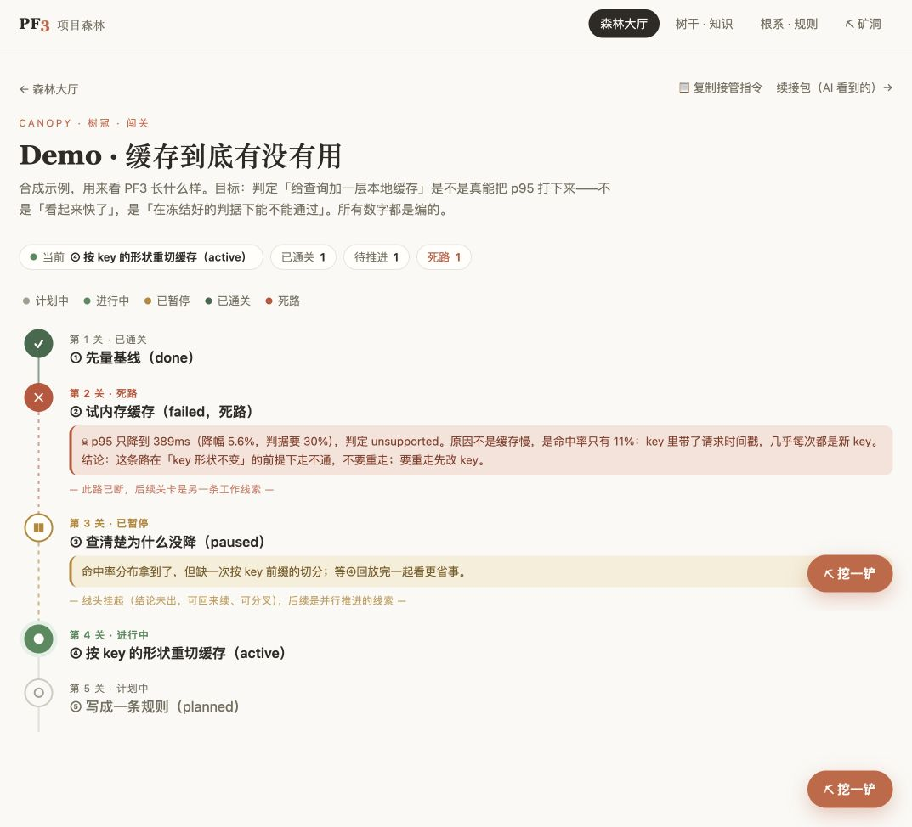
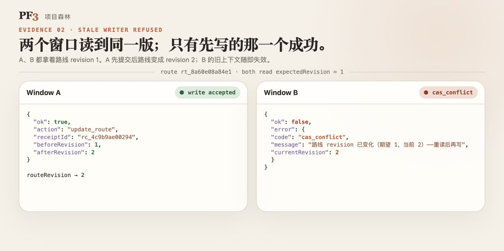

# PF3 Showcase · Project Forest 3

**多个 AI 窗口，接着同一份项目状态干活。**

[English](README.md) · [运行示例](#几分钟跑通交接) · [交接协议](protocol/README.zh-CN.md) · [与 Elara 合作](COLLABORATE.md)

换一个窗口，目标、进度和失败原因常常要再讲一次。PF3 把这些内容放进长期项目记录，让后续窗口知道当前结论和下一步，并用版本校验拒绝过期状态写回。

我是 **Elara**，PF3 的设计与建设者。我做 **AI 协作流程设计、MCP 与工具接入、定制原型开发**，希望找到有真实问题、愿意一起验证结果的合作伙伴。

这里公开一份小范围的**交接协议草案、JSON Schema、独立参考实现与契约测试**，以及合成演示材料。完整 PF3 实现与运行数据保留私有。



*完整 PF3 的合成项目截图，不是客户数据。下方独立示例只实现版本交接，不提供图中的完整界面。*

## 几分钟跑通交接

需要 **Node.js ≥ 24**，没有第三方依赖，不需要安装依赖、填写密钥或连接模型。

```sh
git clone https://github.com/zhaoxiuyue/pf3-showcase.git
cd pf3-showcase
npm run demo
npm test
```

测试命令会对参考实现与 frozen 返回值的合法对照实现，各运行同样的六项契约检查。见 [v0.2.3 对照验证](docs/contract-audit-v0.2.3.md)。

你会看到：

1. A、B 都读取 revision 1 的摘要和下一步。
2. A 写入新进展，收到回执，状态变为 revision 2。
3. B 带旧 revision 1 写入，被 `cas_conflict` 拒绝，原状态保持不变。
4. B 重读 revision 2，理解 A 的进展后继续，状态变为 revision 3。

示例使用进程内合成数据，退出即结束。它不连接私有 PF3、MCP 或模型，不包含持久化、撤销、权限或完整项目树。公开的契约测试验证这个小闭环。

## 开放了什么

展示包版本为 **0.2.3**，协议为 **PF3 Handoff v0.1 draft**。Schema 本轮未改动，`$id` 仍固定到 `v0.2.1`；[协议文档](protocol/README.zh-CN.md#版本与示例)说明单条消息与交接轨迹的区别。

| 内容 | 可以拿来做什么 |
|---|---|
| [交接协议 v0.1 草案](protocol/README.zh-CN.md) | 理解读状态、声明版本、写入、拒绝与重读的行为约定 |
| [JSON Schema](protocol/handoff.schema.json)、[单条消息](protocol/examples/state.json)与[交接轨迹](protocol/examples/exchange-trace.json) | 检查字段结构，制作自己的接入样例 |
| [独立参考实现](demo/handoff.mjs) | 修改摘要与下一步，观察版本和回执如何变化 |
| [可复用契约测试](conformance/handoff.mjs) | 将自己的同步 JavaScript 实现接到同一组行为检查 |
| [实测材料与范围](docs/evidence.md) | 区分可亲自运行的示例、作者记录与实际产品能力 |

**这是一份最小交接约定，不是完整 PF3 的 MCP 协议或兼容性认证。** 通过测试只为它实际执行的用例提供证据；连接完整 PF3、扩展到真实业务与多人场景，需要另外验证。



*2026-09-12 完整 PF3 合成库返回的并排排版。上面的独立示例展示同类机制，但不是截图对应的服务。*

## 从作品到合作

适合带来的问题：换窗口后反复解释、AI 与现有工具接不上、结果散落难以接手、工作完成后难以核验。

优先从一个**范围清楚、能运行、有验收标准的付费验证**开始，再判断是否扩大交付。也欢迎联合开发，请说明你能提供的场景、技术、用户或持续投入。

当前完整 PF3 验证的是单个所有者使用多个 AI 客户端；多人权限与企业流程需要在具体场景中验证。按作者 2026-09-11 的历史快照，实例有 12 个项目、224 个节点和 1776 张回执。这是自述统计，不是客户数量或第三方认证。相关研究案例 MountainRS 将另行公开。

**[合作方向与联系模板](COLLABORATE.md)** · **Elara：[XiuyueZhao@outlook.com](mailto:XiuyueZhao@outlook.com)**

## 许可

除 `docs/` 外，随包分发的协议、Schema、参考代码与测试采用 [Apache-2.0](LICENSE)；`docs/` 下的文字、记录与图片采用 [CC BY 4.0](docs/LICENSE-docs.md)。另见 [NOTICE](NOTICE)。完整 PF3 内核、内部文档、Git 历史、数据库与知识正文不在这个仓库中。
