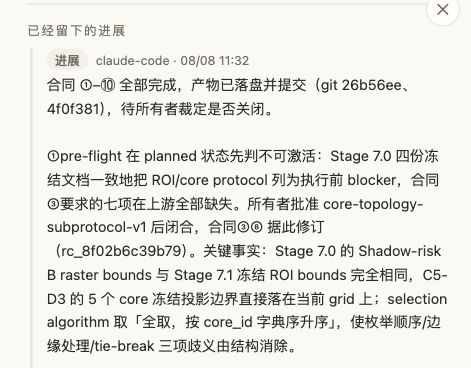
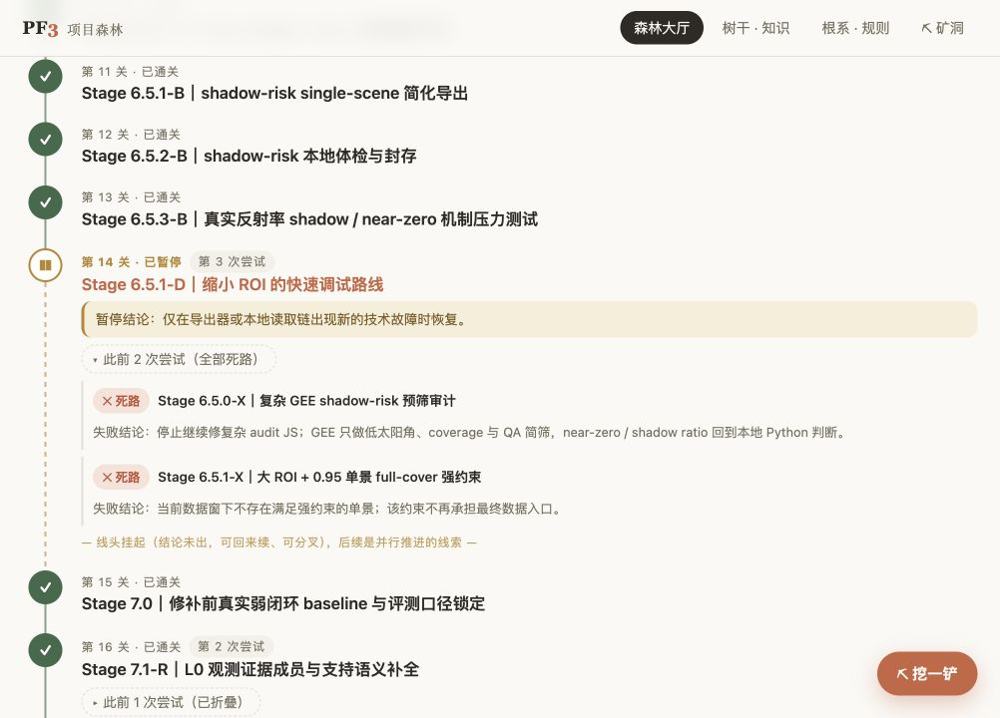

# MountainRS：网页讨论与本地执行，共用一棵树

[English](mountainrs.md) · [Showcase 首页](../README.zh-CN.md)

MountainRS（山地遥感物理基座）是 Elara 的遥感研究项目。它的 PF3 工作流连接了 ChatGPT 网页与本地的 Claude Code、Codex，参与者通过同一棵树处理目标、契约、发现和决定。

[复盘](https://github.com/zhaoxiuyue/MountainRS/blob/b609450b8c1cea920df2bc256dbab1e55683c302/docs/one-tree-three-clients.md#三三个角色一个真相源)记录了网页讨论提出修改、本地执行读取文件核验、所有者裁定意图与代价的分工。这是该项目的角色安排。历史客户端统计使用 `oauth:chatgpt`、`claude-code`、`codex` 标签，不逐一标识每次模型交互。

## Stage 7.3

**方案依赖的定义，实际还不存在。** Stage 7.3 处理单个研究区域内的空间评估块。它的合同假定上游文件已经唯一给出 core 形状、尺寸、网格锚点、候选枚举顺序、边缘处理、并列 tie-break 与 selection algorithm。

8 月 6–8 日的工作中，本地窗口读取四份 Stage 7.0 冻结文档，发现它们仍把正式 ROI/core 协议列为执行前提，合同要求的七项全部缺失。因此首轮 preflight 判定 Stage 7.3 不可激活。

8 月 8 日，所有者批准 core-topology 子协议，采用五个现成 core，确定“全取、按 `core_id` 字典序升序”的选择规则。合同③与⑧据此修订，记录的回执为 `rc_8f02b6c39b79`。之后的 preflight 记录定义与评分口径已经唯一可执行。在这个项目的工作约定中，检查通过后仍要等待所有者的执行指令。

缺失的前提、获批决定与修订合同留在项目记录里。后来的网页讨论或本地窗口可以查看路线为什么走到这里，本地发现也由此回到规划与审查中。

### 读取执行记录

*2026 年 9 月 19 日截取的原始界面局部，文字与布局均未修改。展示节点 `nd_38d128c40d90` 中 8 月 8 日 11:32 的进展，读取时路线版本为 100。这是后来读取历史条目的画面，不是 8 月执行过程的录屏。[可见内容的英文翻译](mountainrs.md#read-the-execution-record)。*

### 顺着公开文件核对

| 来源 | 可以检查什么 |
|---|---|
| [Activation preflight manifest](https://github.com/zhaoxiuyue/MountainRS/blob/b609450b8c1cea920df2bc256dbab1e55683c302/stage7_real_weak_closure/stage7_3_spatial_blocking/evidence/preflight-manifest-v1.json) | `upstream_documents` 标明四份来源；`verdict.blocking_history` 记载定义缺失及后来的闭合；`approved_subprotocol` 保留批准日期、路径和 hash。 |
| [Core-topology 子协议](https://github.com/zhaoxiuyue/MountainRS/blob/b609450b8c1cea920df2bc256dbab1e55683c302/stage7_real_weak_closure/stage7_3_spatial_blocking/docs/core-topology-subprotocol-v1.md) | §1–§5 解释缺口、已有 core 几何、选择算法与评估口径映射。 |
| [协作复盘](https://github.com/zhaoxiuyue/MountainRS/blob/b609450b8c1cea920df2bc256dbab1e55683c302/docs/one-tree-three-clients.md#三三个角色一个真相源) | 作者记录的网页、本地、所有者分工及合同修订。 |

链接固定到科研仓库的 `b609450` 提交。公开文件支持核对前提缺失及其解决过程；客户端分工与私有回执引用仍属于作者记录的协作历史。截图本身没有展示网页端的动作，也不证明新客户端已经完成一次续接。

## 一个状态标签还没说清什么

新 AI 窗口看到 Stage 6.5.1-D 标着 `paused`，只靠这个标签，还判断不了该不该回来续。记录中的原因给出了条件：仅在导出器或本地读取链出现新的技术故障时恢复。前面两次失败尝试也各自保留结论，下一窗口可以查看它们为什么停下。

这个案例展示接手时可以读到的信息：状态、原因，以及继续工作的条件。下面是具体记录。

## 先看树上的一段

*真实界面直接截图，已展开两次失败尝试。*

1. **复杂 GEE 预筛失败了。** Stage 6.5.0-X 留下结论：停止继续修复杂 audit JS；Google Earth Engine（GEE）只做低太阳角、coverage 与 QA 简筛，near-zero / shadow ratio 回到本地 Python 判断。
2. **覆盖要求找不到合格的单景。** Stage 6.5.1-X 记录：当前数据窗下，不存在满足“大 ROI + 95% 单景覆盖”强约束的影像。这个约束不再承担最终数据入口。
3. **缩小 ROI 的调试路线保留为暂停。** Stage 6.5.1-D 写明：仅在导出器或本地读取链出现新的技术故障时恢复。后续主线上，Stage 7.0 与 Stage 7.1-R 则记录为 done。

新窗口能直接读到：哪些路已经失败、结论是什么、什么情况下才值得回来续。记录保留了这些区别，而不只是一个完成百分比。

## 从续接包读到原始记录

这是 Elara 在 MountainRS 项目中的历史工作配置，读取日期为 2026 年 9 月 18 日，包含学习安排、指定执行者与审查者分工等个性化规则。它们不是 PF3 的通用默认规则，也不应直接当成适用于所有项目的安全或审计政策。这里的“全局规则”指作者跨项目使用的规则，不是每个 PF3 安装实例必须采用的制度。规则文本用于指导工作，不等同于已经验证的服务端权限控制。项目编号、版本和资产路径是记录引用，不授予服务访问权；部分资产不随仓库分发。

**2026 年 9 月 18 日**实时读取返回项目版本 **6**、路线版本 **100**。直接查看[PF3 实际返回的 Markdown 原文](mountainrs-resume.zh-CN.md)和[对应英文翻译](mountainrs-resume.en.md)：规则正文与资产位置均保留，原文不改写，英文按同一章节顺序翻译。

1. `pf3_resume` 按顺序返回适用规则、项目与路线、当前节点、写回合同、资产。这个项目当前为 `no_active_node`，生命周期为 `abandoned`，由所有者主动停工。首个 planned 节点是 Stage 7.9；它是路线位置，不是激活许可。
2. 路线标出失败与暂停节点，另外的 `pf3_read_node` 调用取得其原因原文，对应截图里的两次失败结论与调试恢复条件。
3. 资产位置和 hash 是执行手登记的引用，真实返回会提示用前复验；写回版本也只代表读取当时的快照。

此前的[精选原始字段](mountainrs-handoff.json)仍保留节点 ID、原因原文与版本；现在也可以直接阅读完整续接原文，看到它们周围的规则与资产引用。这些材料展示实际记录与返回内容，不冒充模型完成工作的调用实录。

英文页面使用同一组真实截图，在图旁翻译可见记录。[设计说明](design.zh-CN.md)解释这些记录怎样支持协作与续接。

## 快照与范围

| 记录项 | 值 |
|---|---|
| 项目 | `proj_6cbeea3266ff`，revision **6** |
| 路线 | `rt_f634f0ab72fb`，revision **100** |
| 节点 | **36**：23 done、2 failed、1 paused、10 planned、0 active |
| 项目生命周期 | `abandoned`；所有者于 9 月 10 日停工，等待外部合作 |

[项目树记录摘录](mountainrs-tree.json)列出全部 36 个节点的 ID、标题和状态，并保留两条失败节点与一条暂停节点的原因原文。它从本次获授权的实时读取中精选展示字段，不是对外定义的 PF3 API 返回格式。

这是作者记录的真实项目工作流。节点 done 表示该项工作已关闭，不等于科研假设得到支持。[MountainRS 科研仓库](https://github.com/zhaoxiuyue/MountainRS)已于 2026 年 9 月 18 日公开，可直接查看报告、[Stage 7.6 精选结果表](https://github.com/zhaoxiuyue/MountainRS/tree/main/stage7_real_weak_closure/stage7_6_optical_operator/outputs)与[项目管理复盘](https://github.com/zhaoxiuyue/MountainRS/blob/main/docs/one-tree-three-clients.md)。多数大型输入与产物仍不随 Git 分发，因此仅靠仓库尚不能端到端重跑科研全过程。[路线图](roadmap.md#中文)区分本次材料公开与未来新客户端续接的实测证据。
